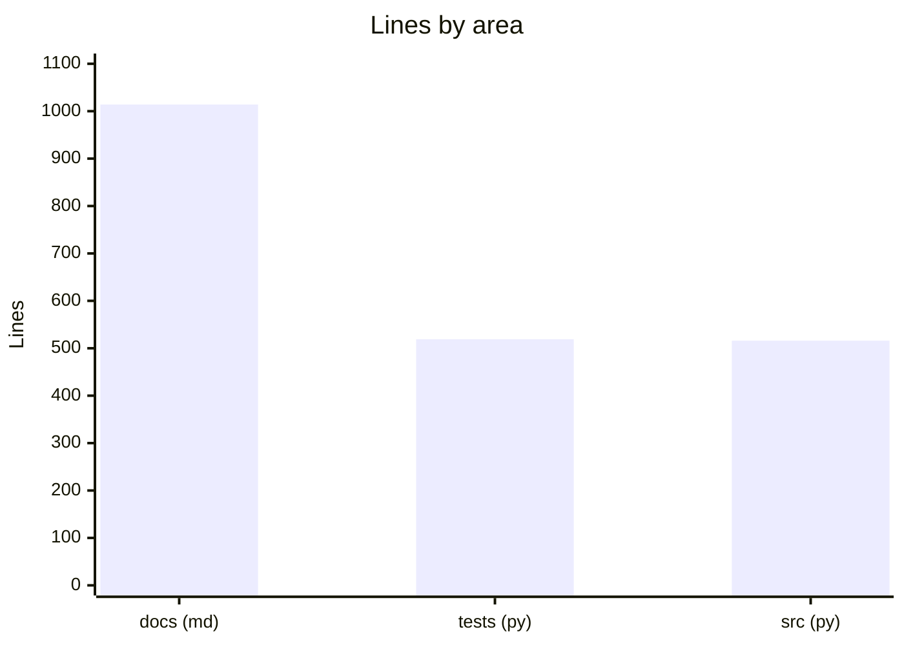
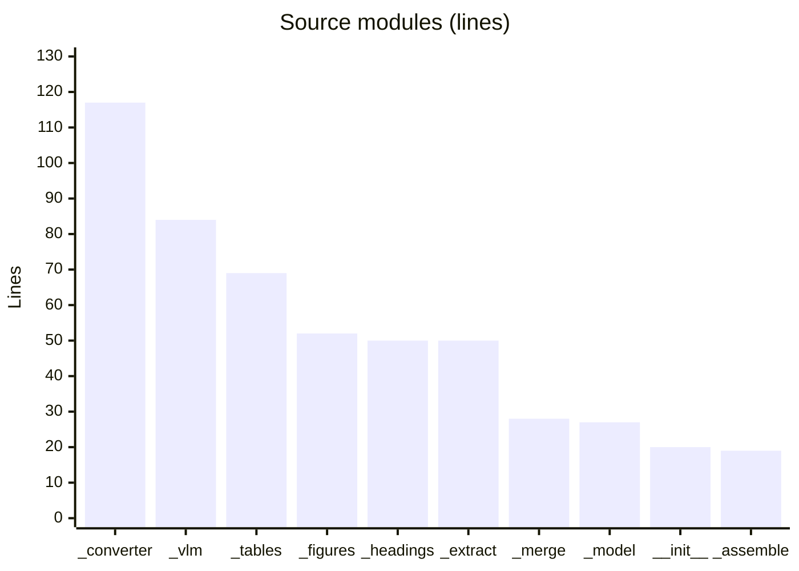

# By the numbers

Data collected on 2026-06-27 at commit `2a2c3fc`.

A quantitative snapshot of the codebase. This is a small, single-purpose plugin: the source is compact, the test code is about the same size as the source, and the documentation is larger than both combined.

## Size

The shipped library is 516 lines of Python across 10 modules. The test suite is roughly the same size, and the `docs/` Markdown (design notes, memory, API reference) is the largest body of text in the repo.

| Area | Files | Lines |
| --- | ---: | ---: |
| `src/markitdown_pdf_plus/` | 10 | 516 |
| `tests/` (incl. conftest + eval) | 13 | 519 |
| `scripts/` | 2 | ~110 |
| `docs/` (Markdown) | 9 | ~1014 |

The test-to-source ratio is about 1:1 by line count.

## Source modules by size

| Module | Lines | Role |
| --- | ---: | --- |
| `src/markitdown_pdf_plus/_converter.py` | 117 | orchestration, de-dup, full-page branch |
| `src/markitdown_pdf_plus/_vlm.py` | 84 | endpoint adapter, prompts, fail-soft |
| `src/markitdown_pdf_plus/_tables.py` | 69 | ruled + borderless detection, grid fallback |
| `src/markitdown_pdf_plus/_figures.py` | 52 | image-region extraction + crop rendering |
| `src/markitdown_pdf_plus/_headings.py` | 50 | font-tier heading classification |
| `src/markitdown_pdf_plus/_extract.py` | 50 | pdfminer line extraction |
| `src/markitdown_pdf_plus/_merge.py` | 28 | cross-page table merge |
| `src/markitdown_pdf_plus/_model.py` | 27 | `Line` / `Block` dataclasses |
| `src/markitdown_pdf_plus/__init__.py` | 20 | plugin registration |
| `src/markitdown_pdf_plus/_assemble.py` | 19 | reading-order rendering |

## Activity

The repository was created and reached its v0.1.0 release in a concentrated burst: all 26 commits land in June 2026. The history has two phases visible in the commit messages: a feature-by-feature build (the `feat:`/`test:` sequence creating each stage), then a cluster of `fix:` commits that the real-document eval forced (see [Build findings](background/build-findings.md)).

| Metric | Value |
| --- | ---: |
| Total commits | 26 |
| Active months | 1 (June 2026) |
| Tags | 1 (`v0.1.0`) |

### Churn hotspots (whole history)

The most frequently changed files mirror where the hard problems live: the orchestrator and the table detector.

| File | Changes |
| --- | ---: |
| `src/markitdown_pdf_plus/_converter.py` | 6 |
| `tests/test_tables.py` | 5 |
| `tests/conftest.py` | 5 |
| `src/markitdown_pdf_plus/_tables.py` | 5 |
| `src/markitdown_pdf_plus/_headings.py` | 3 |
| `src/markitdown_pdf_plus/_extract.py` | 3 |

## Bot-attributed commits

9 of 26 commits (about 35%) carry a `Co-authored-by` trailer attributing AI assistance. This is a lower bound on AI-assisted work, since inline AI tools leave no trace in git history, and the project was built through an agent-driven design-and-TDD workflow. The figure counts only commits whose message explicitly records co-authorship.

## Complexity

The codebase is intentionally simple. ruff enforces a McCabe cyclomatic complexity ceiling of 10 per function, and there are zero `TODO`/`FIXME`/`HACK` markers in `src/` or `tests/` (the flake8-todos lint rule requires any such marker to be tracked or linked). The largest single module is the orchestrator at 117 lines. See [Tooling](how-to-contribute/tooling.md).
