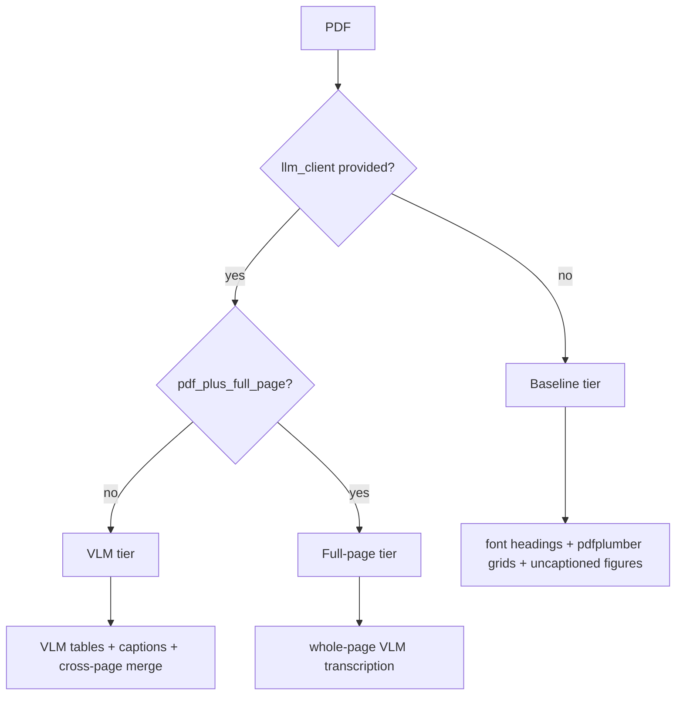

# Capabilities and modes

Active contributors: Mehmet Akgunay

This section describes what the plugin does from a user's point of view: the capability tiers, how to configure each, and when to reach for each mode. For the code behind these capabilities, see [The conversion pipeline](../systems/index.md).

## The three tiers

The plugin is built around graceful degradation: it produces useful output at every capability level and is never worse than MarkItDown's built-in PDF converter.

| Tier | Trigger | Output | Page |
| --- | --- | --- | --- |
| Baseline | no client | font headings, pdfplumber table grids, figure regions | [Structure extraction](structure-extraction.md) |
| VLM | `llm_client` + `llm_model` | clean VLM tables, figure captions, cross-page merge | [VLM tables and captions](vlm-tables-and-captions.md) |
| Full page | `pdf_plus_full_page=True` + client | each page transcribed whole by the VLM | [Full-page mode](full-page-mode.md) |

## What is always on

Regardless of whether you provide a VLM:

- **Font-heuristic headings** (`#`/`##`/`###`) recovered from font sizes, no ML.
- **Clean body text** via pdfminer, avoiding the run-together words pdfplumber produces on justified text.
- **Figure extraction** of embedded image regions (saved to disk only if `pdf_plus_image_dir` is set).
- **Table detection** of ruled and borderless tables, rendered as pdfplumber grids when no VLM is available.

## What the VLM adds

- **Clean table transcription** of each detected region into Markdown pipe tables.
- **Figure captions** describing chart type, axes, and trends.
- **Cross-page table merging** of tables that span a page break.

The plugin is **model-agnostic**: any OpenAI-compatible vision endpoint works, local (Ollama, LM Studio) or cloud (OpenAI, Gemini).

## Known limitations

- **Single-column layouts only.** Reading order is a positional sort that can interleave columns; use full-page mode for multi-column documents.
- **Scanned PDFs** (no text layer) produce no headings or fallback tables; use full-page mode with a capable VLM.
- **No bundled OCR** and **no equation → LaTeX** conversion; display equations remain inline text.
- **Table detection is heuristic** and not perfect on every layout.

See [Configuration](../reference/configuration.md) for every tuning option and [Research and benchmarks](../background/research-and-benchmarks.md) for measured quality.
