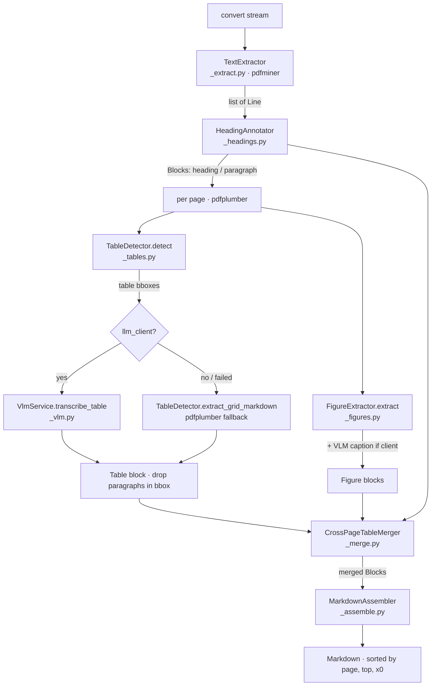

# Architecture

The plugin is a pipeline of small, single-purpose stages orchestrated by a thin converter. Each stage does one thing, takes a simple input, and returns a simple output, so each can be tested in isolation. The orchestrator (`src/markitdown_pdf_plus/_converter.py`) wires them together; understanding the data flow means reading several stage files alongside it.

## The conversion pipeline

1. **`TextExtractor`** (`src/markitdown_pdf_plus/_extract.py`) reads the PDF with pdfminer and returns a `list[Line]` — each line's text, median font size, bold flag, and a top-left bounding box.
2. **`HeadingAnnotator`** (`src/markitdown_pdf_plus/_headings.py`) classifies each line as a heading (`#`/`##`/`###`) or paragraph by comparing its font size to the modal body size.
3. Per page (via pdfplumber):
   - **`TableDetector`** (`src/markitdown_pdf_plus/_tables.py`) finds ruled and borderless table regions. Each region is transcribed by the VLM if a client is present, otherwise by a pdfplumber grid fallback. The table's own paragraph lines inside the bounding box are then dropped to avoid duplication.
   - **`FigureExtractor`** (`src/markitdown_pdf_plus/_figures.py`) finds image regions, optionally saves PNG crops, and (with a client) captions them.
4. **`CrossPageTableMerger`** (`src/markitdown_pdf_plus/_merge.py`) joins consecutive table blocks that span a page break.
5. **`MarkdownAssembler`** (`src/markitdown_pdf_plus/_assemble.py`) sorts all blocks into reading order and renders the final Markdown.

## Full-page mode (the escape hatch)

When `pdf_plus_full_page=True` and a VLM client is present, `convert()` short-circuits the entire pipeline above. It renders each page to a full-resolution PNG and sends the whole page to the VLM, concatenating the per-page Markdown. This handles multi-column, scanned, and equation-heavy documents that the positional pipeline cannot. See [Full-page mode](../features/full-page-mode.md).

## Data model

Two dataclasses in `src/markitdown_pdf_plus/_model.py` carry data between stages:

- **`Line`** — one extracted text line: `page`, `text`, `font_size`, `bold`, and a `bbox` (`x0, top, x1, bottom` in PDF points, top-left origin).
- **`Block`** — a positioned unit of output: `kind` (`heading` / `paragraph` / `table` / `figure`), `page`, `top`, `x0`, plus kind-specific fields (`text`, `level`, `markdown`, `image_path`, `caption`, `bbox`, `cols`).

`BBox` is a type alias for `tuple[float, float, float, float]`.

## Coordinate frames (a load-bearing detail)

pdfminer uses a **bottom-left origin**; pdfplumber and pypdfium2 use a **top-left origin**. `TextExtractor` converts pdfminer's y-coordinates to top-left (`top = page_height - y1`) so that line bounding boxes line up with the pdfplumber geometry used by table and figure detection. The table-text de-duplication step depends on this alignment; break the conversion and de-dup silently fails. See [Build findings](../background/build-findings.md).

## Configuration flow

Configuration flows from `MarkItDown(...)` keyword arguments into the plugin's entry point. `register_converters` in `src/markitdown_pdf_plus/__init__.py` builds the optional `VlmService` (returns `None` when no `llm_client`/`llm_model` is supplied) and a config dict, then registers `PdfPlusConverter` at priority `-1.0`. CLI users set `pdf_plus_*` values via environment variables. See [Configuration reference](../reference/configuration.md).

## Why this shape

The pipeline-of-stages design (rather than subclassing the built-in converter or writing a monolith) sidesteps a body-text spacing regression in markitdown 0.1.6 and keeps every stage independently testable and reviewable. The VLM path is endpoint-based on purpose: it stays model-agnostic and MIT-clean, with no in-process ML dependency. The reasoning behind these choices is documented in [Design decisions](../background/design-decisions.md).

## Module map

| File | Responsibility |
| --- | --- |
| `src/markitdown_pdf_plus/_model.py` | `Line`, `Block` dataclasses + `BBox` alias |
| `src/markitdown_pdf_plus/_extract.py` | `TextExtractor` — pdfminer lines, bottom-left → top-left conversion |
| `src/markitdown_pdf_plus/_headings.py` | `HeadingAnnotator` — modal body size, font tiers, short-bold promotion |
| `src/markitdown_pdf_plus/_tables.py` | `TableDetector` — ruled + borderless detection, grid fallback |
| `src/markitdown_pdf_plus/_figures.py` | `FigureExtractor` + `render_bbox_png_b64` (pypdfium2 crop) |
| `src/markitdown_pdf_plus/_vlm.py` | `VlmService` (fence-strip, validation, fail-soft) + `build_vlm_service` |
| `src/markitdown_pdf_plus/_merge.py` | `CrossPageTableMerger` — consecutive pages, equal columns |
| `src/markitdown_pdf_plus/_assemble.py` | `MarkdownAssembler` — reading-order sort + per-block rendering |
| `src/markitdown_pdf_plus/_converter.py` | `PdfPlusConverter` — orchestration, de-dup, full-page branch |
| `src/markitdown_pdf_plus/__init__.py` | plugin interface version + `register_converters()` |
