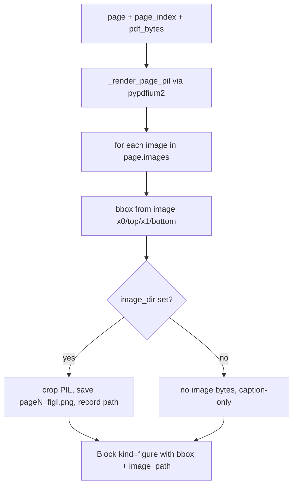

# Figures

Active contributors: Mehmet Akgunay

## Purpose

`FigureExtractor` (`src/markitdown_pdf_plus/_figures.py`) detects embedded image regions on each page and emits `Block(kind="figure", ...)` entries. The same module provides the rasterization helpers used across the plugin to crop page regions to PNG: `render_bbox_png_b64` (for VLM input) and `_render_page_pil` (for full-page mode). Captions are added separately by the [VLM service](vlm-service.md) when a client is present.

## How it works

For each entry in pdfplumber's `page.images`, the extractor builds a bbox and a figure block. If `image_dir` is configured, it renders the page once with pypdfium2 (`_render_page_pil`), crops to the image bbox at the configured DPI scale, saves a PNG named `page{page}_fig{i}.png`, and stores the relative path on the block. If `image_dir` is `None`, no image bytes are written and the figure is caption-only, which keeps the Markdown lean for LLM consumption.

## Rasterization helpers

- **`_render_page_pil(pdf_bytes, page_index, dpi)`** opens the PDF with pypdfium2, renders the page at `scale = dpi / 72.0`, and returns `(pil_image, scale, page_height_pts)`.
- **`render_bbox_png_b64(pdf_bytes, page_index, bbox, dpi=200)`** renders the page, crops to the scaled bbox, and returns a base64-encoded PNG string. This is what feeds table crops and figure crops to the VLM. It is imported by [orchestration](orchestration.md) and used for both tables and figure captioning.

Cropping multiplies the PDF-point bbox by `scale` to get pixel coordinates, which is why the bbox must be in the same top-left frame the rest of the pipeline uses.

## Key abstractions

| Type / function | File | Description |
| --- | --- | --- |
| `FigureExtractor` | `src/markitdown_pdf_plus/_figures.py` | `extract(page, page_index, pdf_bytes) -> list[Block]` |
| `render_bbox_png_b64` | `src/markitdown_pdf_plus/_figures.py` | page-region crop → base64 PNG |
| `_render_page_pil` | `src/markitdown_pdf_plus/_figures.py` | full-page render via pypdfium2 |

## Integration points

- **Input:** a pdfplumber `page`, its index, and the raw PDF bytes.
- **Output:** `list[Block]` of figure blocks, extended into the converter's block list.
- When a VLM client is present and a figure has a bbox, the converter renders a crop and calls `VlmService.caption_figure` to set `block.caption`.
- `MarkdownAssembler` renders a figure block as ``; with `image_dir=None` both parts may be empty, so a captioned figure with no saved image renders as ``.

## Entry points for modification

To change figure naming, save format, or which images qualify, edit `FigureExtractor.extract` in `src/markitdown_pdf_plus/_figures.py`; tests are in `tests/test_figures.py`. The rendering helpers are shared, so changes to `_render_page_pil` affect table crops and full-page mode as well.
