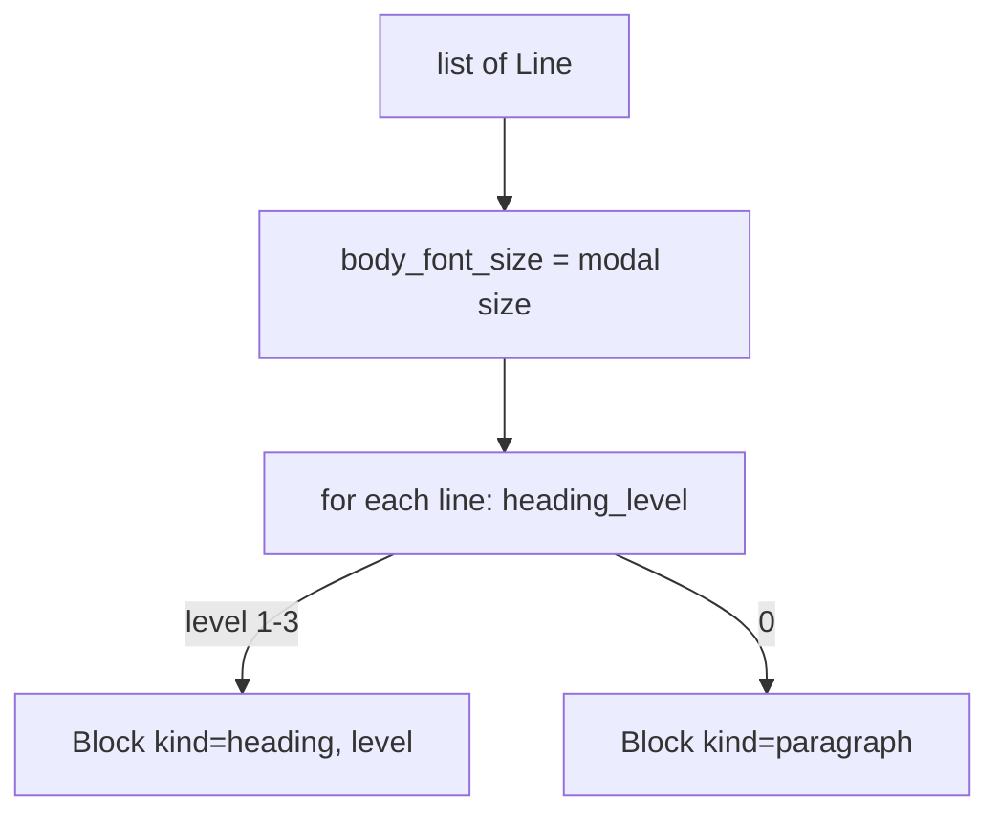

# Heading detection

Active contributors: Mehmet Akgunay

## Purpose

`HeadingAnnotator` (`src/markitdown_pdf_plus/_headings.py`) turns the `list[Line]` from [text extraction](text-extraction.md) into a `list[Block]`, classifying each line as a `heading` (level 1-3) or a `paragraph`. This is the always-on, no-ML structure lever that recovers the heading hierarchy a layout model would otherwise produce.

## How it works

The annotator first computes the **body font size**: the modal (most common) rounded font size across non-empty lines, via `body_font_size`. Headings are detected relative to this baseline by `heading_level`:

| Condition on line size vs body | Level | Extra requirement |
| --- | --- | --- |
| `size ≥ body + 3` | 1 (`#`) | line is "short" |
| `size ≥ body + 1.5` | 2 (`##`) | line is "short" |
| `size ≥ body + 0.6` | 3 (`###`) | line is "short" |
| same size, no size signal | 2 (`##`) | line is short **and** bold |
| otherwise | 0 (paragraph) | — |

A line is **short** when it is under 80 characters and does not end with a period. The same-size-bold rule catches section headers that use the body font but are bolded; real section headers are usually a larger font, so this is a fallback signal.

## The tightening that matters

The original heuristic also promoted short **numbered** lines (matching `^\d+(\.\d+)*`). On data tables, numeric row labels like `2.1` matched and became spurious `##` headings. That promotion was removed: same-size lines are now promoted only when short **and** bold. This both cleaned the output and made the table-region de-dup safe. Because a numbered data row is no longer mis-tagged as a heading, the converter can keep headings inside table regions (real "Table N. ..." captions) while dropping only paragraphs. Do not reintroduce numbered-line promotion without re-checking caption handling. See [Build findings](../background/build-findings.md).

## Key abstractions

| Type / function | File | Description |
| --- | --- | --- |
| `HeadingAnnotator` | `src/markitdown_pdf_plus/_headings.py` | `annotate(lines) -> list[Block]` |
| `body_font_size` | `src/markitdown_pdf_plus/_headings.py` | modal font size of the document |
| `heading_level` | `src/markitdown_pdf_plus/_headings.py` | returns 1-3, or 0 for a paragraph |

## Integration points

- **Input:** `list[Line]` from `TextExtractor`.
- **Output:** `list[Block]` of `heading` and `paragraph` blocks; the converter appends table and figure blocks to this same list before merging and assembly.
- The heading-vs-paragraph distinction is what the de-dup step relies on: it removes paragraph blocks inside a table bbox but preserves heading blocks. See [Orchestration](orchestration.md).

## Entry points for modification

To adjust the heading thresholds or the short/bold rule, edit `heading_level` in `src/markitdown_pdf_plus/_headings.py`; tests are in `tests/test_headings.py` (including a regression that a numbered table row stays a paragraph). Any change here can affect caption preservation downstream, so run the real-document eval afterward.
