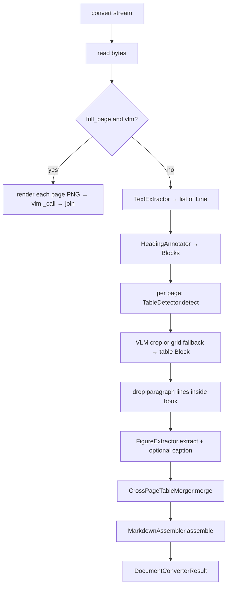

# Orchestration

Active contributors: Mehmet Akgunay

## Purpose

Three files tie the pipeline together: `__init__.py` registers the plugin with MarkItDown, `_converter.py` orchestrates the stages and owns the table-text de-duplication and the full-page branch, and `_assemble.py` renders the final Markdown in reading order. This page covers how a `convert()` call flows through them.

## Registration

`register_converters(markitdown, **kwargs)` in `src/markitdown_pdf_plus/__init__.py` is the entry point MarkItDown calls when `enable_plugins=True`. It:

1. builds the optional `VlmService` via `build_vlm_service(**kwargs)` (returns `None` with no client),
2. assembles a config dict from `pdf_plus_*` kwargs (`full_page`, `image_dir`, `dpi`, `table_fallback`), and
3. registers `PdfPlusConverter(vlm, config)` at **priority −1.0**.

The negative priority means MarkItDown tries this converter before the built-in PDF converter, so it overrides it. The module also declares `__plugin_interface_version__ = 1`. The package is wired as a `markitdown.plugin` entry point named `pdf_plus` in `pyproject.toml`.

## The convert flow



`PdfPlusConverter.accepts` returns true for a `.pdf` extension or a PDF mimetype. `convert` reads the stream once into bytes (because pdfminer, pdfplumber, and pypdfium2 each open it independently), then either takes the full-page branch or runs the structure pipeline.

## Table-text de-duplication

After a table block is appended for a detected region, the converter removes the table's own paragraph lines so their content is not duplicated outside the rendered table:

```python
blocks = [
    b for b in blocks
    if not (b.kind == "paragraph" and b.page == pi and self._line_inside(b, bbox, lines))
]
```

Two details make this correct and safe:

- **Paragraphs only.** Headings inside a table region are kept, because they are real captions ("Table N. ..."). This is safe only because the [heading heuristic](heading-detection.md) no longer mis-tags numbered data rows as headings.
- **Positional matching.** A paragraph `Block` has no bbox, so `_line_inside` matches it back to an original `Line` by page, `top` (within 0.5 pt), and text, then tests whether that line's center sits inside the table bbox via `_inside`. This is why the [text extractor's](text-extraction.md) top-left coordinate conversion must align with the pdfplumber table geometry.

`_col_count` derives a table's column count from its first pipe row; that count drives [cross-page merging](table-handling.md).

## Full-page branch

When `full_page` is set and a VLM client exists, `convert` short-circuits the whole structure pipeline: it counts pages with pdfplumber, renders each page to a PNG via `_render_page_pil`, sends it to `VlmService._call` with the table prompt, and concatenates the per-page Markdown. See [Full-page mode](../features/full-page-mode.md).

## Assembly

`MarkdownAssembler.assemble(blocks)` (`src/markitdown_pdf_plus/_assemble.py`) sorts all blocks by `(page, top, x0)` (a positional reading-order sort) and renders each:

- `heading` → `#` * level + text
- `table` → the block's Markdown, stripped
- `figure` → ``
- `paragraph` → the text

Empty renders are dropped and the rest joined with blank lines. The positional sort is why multi-column layouts can interleave; those documents should use full-page mode.

## Key abstractions

| Type / function | File | Description |
| --- | --- | --- |
| `register_converters` | `src/markitdown_pdf_plus/__init__.py` | plugin entry point; builds VLM + config, registers at −1.0 |
| `PdfPlusConverter` | `src/markitdown_pdf_plus/_converter.py` | `accepts` + `convert`; orchestration |
| `PdfPlusConverter._line_inside` / `_inside` | `src/markitdown_pdf_plus/_converter.py` | positional de-dup matching |
| `PdfPlusConverter._col_count` | `src/markitdown_pdf_plus/_converter.py` | column count from a table's Markdown |
| `MarkdownAssembler` | `src/markitdown_pdf_plus/_assemble.py` | reading-order sort + per-block rendering |

## Integration points

- Subclasses MarkItDown's `DocumentConverter`; returns a `DocumentConverterResult`.
- Consumes every other stage in this section.
- Configuration arrives from `MarkItDown(...)` kwargs through `register_converters`. See [Configuration](../reference/configuration.md).

## Entry points for modification

To change stage wiring, the de-dup rule, or the full-page branch, edit `PdfPlusConverter.convert` in `src/markitdown_pdf_plus/_converter.py`; tests in `tests/test_converter.py` cover heading output, table de-dup, and per-page full-page transcription. To change how a block kind renders, edit `MarkdownAssembler._render` (`src/markitdown_pdf_plus/_assemble.py`). To change registration or priority, edit `register_converters` (`src/markitdown_pdf_plus/__init__.py`); registration is verified in `tests/test_plugin.py`.
