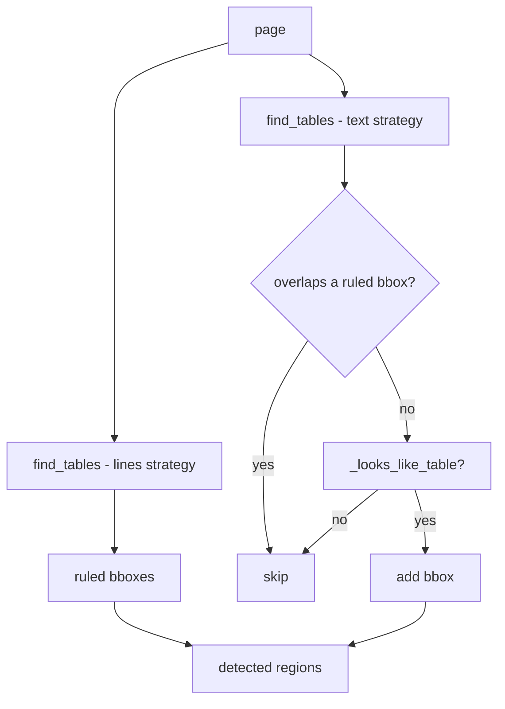

# Table handling

Active contributors: Mehmet Akgunay

## Purpose

Two stages cover tables: `TableDetector` (`src/markitdown_pdf_plus/_tables.py`) finds table regions and provides a no-VLM grid fallback, and `CrossPageTableMerger` (`src/markitdown_pdf_plus/_merge.py`) joins tables that continue across a page break. Detection runs per page; transcription of each region is handled by the [VLM service](vlm-service.md) or the fallback; merging runs once over all blocks.

## Detection: ruled plus borderless

`TableDetector.detect(page)` returns a list of bounding boxes:

1. **Ruled tables** come from pdfplumber's default `find_tables()` (the `lines` strategy).
2. **Borderless tables** come from a second `find_tables(_TEXT_SETTINGS)` pass using the **text strategy**. Each candidate is skipped if it overlaps an already-found ruled table, and otherwise gated by `_looks_like_table`.

The text strategy is essential: pdfplumber's default `lines` strategy finds zero borderless academic tables (they have no ruling lines). `_TEXT_SETTINGS` tunes the clustering (`snap_y_tolerance`, `join_x_tolerance`, `text_x_tolerance`, `min_words_vertical`).



## The numeric-density validator

The text strategy is permissive: left alone it would cluster ordinary prose into a "grid". `_looks_like_table` rejects false positives by requiring a candidate to:

- have at least 3 non-empty rows,
- have at least 2 columns,
- have at most 30% "long" cells (over 40 characters), and
- reach a **numeric density ≥ 0.25** — at least a quarter of non-empty cells contain a digit.

The numeric-density gate is the key discriminator: academic data tables are number-dense, prose is not. On the real test paper this took borderless-table pipe rows from 0 to 609 while a prose page still produces zero detections. See [Build findings](../background/build-findings.md).

## Grid fallback (no-VLM path)

When no VLM client is configured (or a call fails), `extract_grid_markdown(page, bbox)` renders the region with pdfplumber's own cell extraction. It crops the page to the bbox, then tries:

```python
tables = cropped.extract_tables() or cropped.extract_tables(_TEXT_SETTINGS)
```

Trying the text strategy as the second option is critical: a borderless table that detection found via text alignment returns nothing from the default extraction, so without the text-strategy retry the table would collapse back to flattened text. The result is a GitHub-flavored Markdown pipe table (header, separator, body rows). It is messy but structured, never a flat dump.

## Cross-page merge

`CrossPageTableMerger.merge(blocks)` sorts all blocks by `(page, top, x0)`, then folds a table block into its predecessor when:

- both are tables,
- they are on consecutive pages (`b.page == prev.page + 1`),
- they have the same column count (`b.cols == prev.cols`), and
- that column count is greater than zero.

The continuation's body rows (everything after the header and separator, via `_data_rows`) are appended to the previous table's Markdown. A heading between the two tables breaks the chain, because the sort places that heading between them and the predecessor is then no longer a table. Column count is computed by `PdfPlusConverter._col_count` when the table block is created.

## Key abstractions

| Type / function | File | Description |
| --- | --- | --- |
| `TableDetector.detect` | `src/markitdown_pdf_plus/_tables.py` | ruled + borderless region bboxes |
| `TableDetector._looks_like_table` | `src/markitdown_pdf_plus/_tables.py` | numeric-density + shape validator |
| `TableDetector.extract_grid_markdown` | `src/markitdown_pdf_plus/_tables.py` | no-VLM pipe-table fallback |
| `_TEXT_SETTINGS` | `src/markitdown_pdf_plus/_tables.py` | text-strategy clustering settings |
| `CrossPageTableMerger.merge` | `src/markitdown_pdf_plus/_merge.py` | join tables across page breaks |

## Integration points

- **Detection input:** a pdfplumber `page` from `PdfPlusConverter.convert`.
- **Per region:** the converter renders a PNG crop (via `render_bbox_png_b64`, see [Figures](figures.md)) and calls `VlmService.transcribe_table`; on `None` it falls back to `extract_grid_markdown`. The resulting `Block(kind="table", ...)` records the bbox and column count.
- **Merge input/output:** the full `list[Block]`; merging happens after all pages are processed and before assembly.

## Entry points for modification

To tune borderless detection, edit `_TEXT_SETTINGS` and `_looks_like_table` in `src/markitdown_pdf_plus/_tables.py`; tests in `tests/test_tables.py` cover ruled, borderless, prose-rejection, fallback rendering, and a real-paper regression. To change merge conditions (for example to require the first table to end near the page bottom), edit `CrossPageTableMerger.merge` (`src/markitdown_pdf_plus/_merge.py`); tests in `tests/test_merge.py`. A measured structure-model-first alternative is documented in [Roadmap](../background/roadmap.md).
