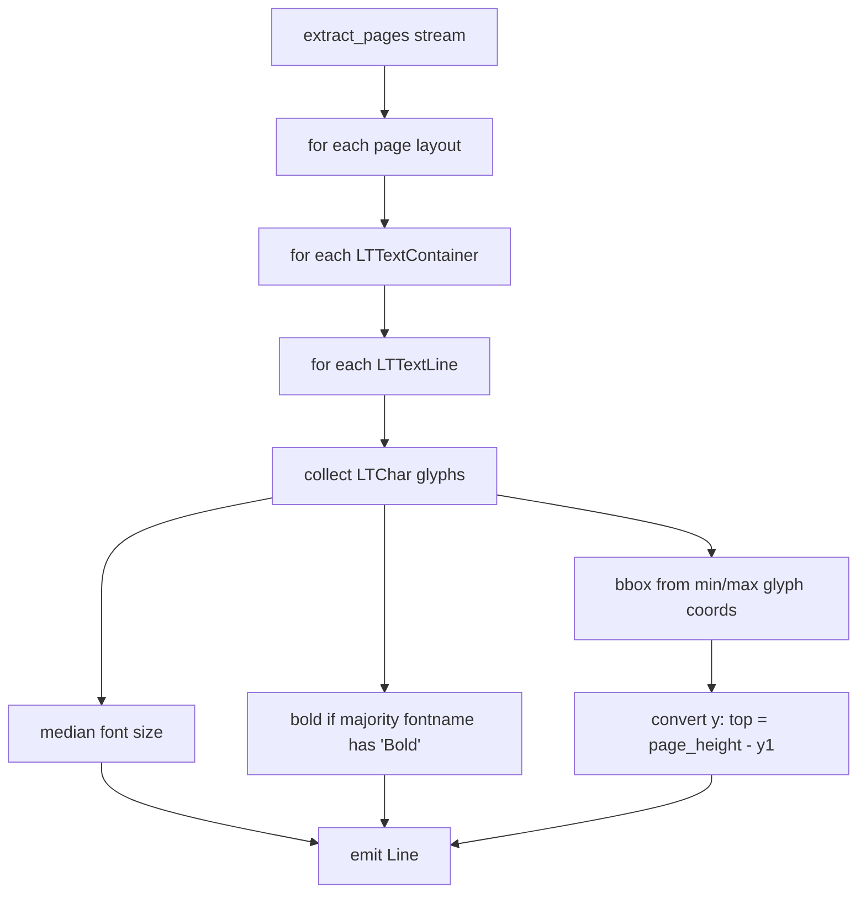

# Text extraction

Active contributors: Mehmet Akgunay

## Purpose

`TextExtractor` (`src/markitdown_pdf_plus/_extract.py`) reads a PDF stream and returns a `list[Line]`: one entry per text line, each carrying the line's text, median font size, a bold flag, and a top-left bounding box. This is the first stage of the pipeline and the input to [heading detection](heading-detection.md).

## Why pdfminer, not pdfplumber words

This stage uses pdfminer's layout analysis (`pdfminer.high_level.extract_pages`) rather than pdfplumber's `extract_words`. On justified and kerned academic text, pdfplumber merges adjacent words and loses the spaces between them, producing "run-together" lines (around 16 per page on the test paper). pdfminer's layout analysis keeps the spacing intact (zero jammed lines). This choice is the reason body text in the plugin reads cleanly where the built-in converter regressed. See [Build findings](../background/build-findings.md).

## How it works



1. Iterate pages with `extract_pages`, capturing each page's `height`.
2. For each `LTTextContainer`, walk its `LTTextLine` children; skip empty lines.
3. Collect the `LTChar` glyphs of the line. The **font size** is the median glyph size (robust to the occasional outlier glyph). The line is **bold** when more than half its glyphs have `"Bold"` in their font name.
4. The **bounding box** spans the min/max glyph x and y.

## The coordinate conversion (load-bearing)

pdfminer uses a **bottom-left origin**: larger y means higher on the page. The rest of the pipeline (pdfplumber table and figure detection, pypdfium2 crops) uses a **top-left origin**. `TextExtractor` converts on the way out:

```python
bbox=(x0, page_height - y1, x1, page_height - y0)
```

This makes each `Line.bbox` directly comparable to the pdfplumber geometry. The table-text de-duplication in [orchestration](orchestration.md) matches lines against table bounding boxes by position; if this conversion is wrong, de-dup silently fails and table text is duplicated. Treat the conversion as an invariant.

## Key abstractions

| Type | File | Description |
| --- | --- | --- |
| `TextExtractor` | `src/markitdown_pdf_plus/_extract.py` | The stage; one public method, `extract(file_stream) -> list[Line]` |
| `Line` | `src/markitdown_pdf_plus/_model.py` | Per-line text + font metadata + top-left bbox |

## Integration points

- **Input:** a binary PDF stream (`BinaryIO`), passed by `PdfPlusConverter.convert`.
- **Output:** `list[Line]` consumed directly by `HeadingAnnotator.annotate` and retained by the converter for de-dup matching.
- The bold flag and font size feed the [heading heuristic](heading-detection.md); the bbox feeds de-dup and reading-order sorting.

## Entry points for modification

To change what counts as a line, how font size is summarized, or how bold is detected, edit `extract` in `src/markitdown_pdf_plus/_extract.py`; its tests live in `tests/test_extract.py`. If you ever revisit the coordinate frame, re-run the real-document eval to confirm de-dup still removes duplicated table text.
