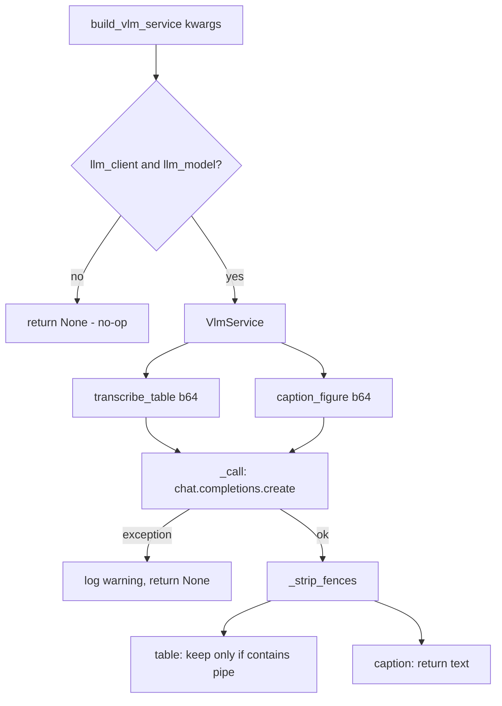

# VLM service

Active contributors: Mehmet Akgunay

## Purpose

`VlmService` (`src/markitdown_pdf_plus/_vlm.py`) is the thin adapter over any OpenAI-compatible vision endpoint. It transcribes table-region crops into Markdown pipe tables and captions figure crops. It is the opt-in backend: when no client is configured, the service is never built and the pipeline degrades to font headings plus pdfplumber grids. The design is endpoint-based on purpose so the plugin stays model-agnostic and MIT-clean, with no in-process ML.

## How it works



### `_call`

The single network method builds a chat-completions request with the image as a `data:image/png;base64,...` URL plus a text prompt, at `temperature=0` and a configurable `max_tokens` (default 4096). It returns the message content, or `None` on any exception (logged as a warning). This is the fail-soft contract: a single bad call never aborts the document; the caller falls back to the pdfplumber grid.

### `transcribe_table`

Calls `_call` with the table prompt, strips Markdown code fences with `_strip_fences`, and returns the result only if it contains a pipe character (`|`). A refusal or prose answer (no pipe) returns `None`, so the converter falls back.

### `caption_figure`

Calls `_call` with the caption prompt and returns the fence-stripped text (or `None`).

## Prompts

Two defaults live in the module and can be overridden via config:

- **`DEFAULT_TABLE_PROMPT`** asks for a GitHub-flavored pipe table preserving every row label, column header, numeric value, parenthesized standard error, and significance marker, with no surrounding prose.
- **`DEFAULT_CAPTION_PROMPT`** asks for a 1-3 sentence description of chart type, axes, series, and main trend, plus a small Markdown table for discrete values.

Override them with `pdf_plus_table_prompt` and `pdf_plus_caption_prompt`.

## Construction

`build_vlm_service(**kwargs)` returns `None` unless both `llm_client` and `llm_model` are provided. Otherwise it constructs a `VlmService` with the prompts and `pdf_plus_max_tokens` from config. This is the single switch that turns the VLM tier on or off.

## Key abstractions

| Type / function | File | Description |
| --- | --- | --- |
| `VlmService` | `src/markitdown_pdf_plus/_vlm.py` | endpoint adapter with table + caption methods |
| `VlmService._call` | `src/markitdown_pdf_plus/_vlm.py` | the one chat-completions call; fail-soft |
| `build_vlm_service` | `src/markitdown_pdf_plus/_vlm.py` | returns a service or `None` |
| `_strip_fences` | `src/markitdown_pdf_plus/_vlm.py` | remove ```` ``` ```` wrappers from model output |

## Integration points

- Built in `register_converters` (`src/markitdown_pdf_plus/__init__.py`) and passed to `PdfPlusConverter`.
- The converter calls `transcribe_table` per detected table region and `caption_figure` per figure (with a rendered crop from `render_bbox_png_b64`).
- In full-page mode the converter calls `_call` directly with a whole-page PNG and the table prompt. See [Full-page mode](../features/full-page-mode.md).
- Any OpenAI-compatible client works: local Ollama / LM Studio, or cloud OpenAI / Gemini.

## Entry points for modification

To change request shape, retries, or output validation, edit `_call`, `transcribe_table`, or `caption_figure` in `src/markitdown_pdf_plus/_vlm.py`; tests in `tests/test_vlm.py` use a deterministic `MockClient` and cover fence stripping, non-table rejection, and exception handling. Keep the fail-soft contract: degrade to `None`, never raise.
